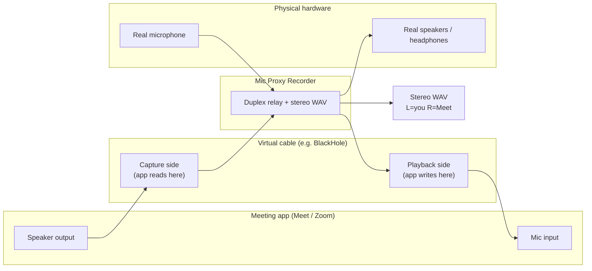

# Relay hub architecture (Krisp-style core, without Krisp’s AI layer)

## Product intent

The user wants **all meeting audio to pass through this app** so it can **record the full conversation** locally, similar to how [Krisp](https://krisp.ai/) positions its desktop product: virtual endpoints in the meeting app, physical endpoints in the OS, and a relay in the middle.

This repository **does not ship a macOS audio driver**. The **virtual microphone** and **virtual speaker** that appear in Google Meet are provided by a **third-party virtual cable** (typically [BlackHole 2ch](https://existential.audio/blackhole/)). This app implements the **relay logic** on top of that cable.

---

## Signal flow (target behaviour)

1. **Uplink (you → others)**  
   Physical microphone → optional denoise → resample → **write to virtual playback** (Meet uses the same device as **microphone**).

2. **Downlink (others → you)**  
   Meet plays remote audio into the virtual device as **speakers** → the app **captures virtual input** → resample → **write to physical speakers** so you hear the call.

3. **Recording**  
   For each instant, **L channel** = your processed voice, **R channel** = remote audio from the virtual capture (zero-padded if one path is momentarily shorter). Written as a **single stereo WAV** at a fixed rate (48 kHz).

---

## Why the previous “half bridge” caused noise / feedback

The earlier implementation only did **mic → virtual playback** and recorded **mono mic only**.

If the user set Meet’s **microphone** to BlackHole but left Meet’s **speakers** on **MacBook speakers**, Meet’s remote audio came out of the **physical speakers**. That sound re-entered the **physical microphone**, creating an **acoustic feedback loop** (and “fighting” between mic and speaker paths).

**Correct routing for this architecture:** in Meet, set **both** microphone **and** speaker to the **same virtual cable** (or an aggregate that exposes one logical cable). Then:

- Your voice never needs to come out of the laptop speakers to reach Meet.
- Remote audio never hits the mic on its way to your ears; it goes **virtually** into the cable and is played to headphones by the app.

Headphones / a **closed acoustic path** still help at the physical layer.

---

## OS and driver boundaries

| Responsibility | Owner |
| ---------------| ----- |
| Registering “new mic / new speaker” in the OS | **BlackHole** (or similar driver) |
| Choosing physical mic & physical speakers in the app | **User** (Bluetooth, built-in, etc.) |
| Relay + denoise + recording | **This app** (`meeting_bridge.rs`) |

---

## Implementation phases (status)

| Phase | Scope | Status |
| ----- | ----- | ------ |
| **P0** | Spec (this document) | Done |
| **P1** | Duplex relay: 4 `cpal` streams, stereo 48 kHz WAV, Meet must use virtual for both I/O | Done |
| **P2** | Persist last-used virtual + physical speaker IDs in `settings.json` | Optional follow-up |
| **P3** | Windows-specific virtual cable notes (VB-Cable, etc.) | Doc only |
| **P4** | True in-kernel “Mic Proxy” branded devices | Out of scope for this repo |

---

## API surface (Rust commands)

- `start_meeting_bridge(physical_input_id?, physical_speakers_output_id?, virtual_cable_id, noise_cancel_enabled, noise_cancel_level)`  
  - `virtual_cable_id`: device name used for **both** `get_input_device` (Meet → app) and `get_output_device` (app → Meet).  
  - `physical_speakers_output_id`: `None` = default output device.

- `stop_meeting_bridge()` → `Recording` (stereo WAV path).

---

## Risks and limits

- **Clock drift** between the two input callbacks is absorbed by **independent queues** and **zero-padding** the faster side when pairing for WAV (acceptable for note-taking / transcription use).
- **Sample format**: first implementation may require **f32** devices for all four streams on macOS; other formats return a clear error.
- **CPU**: four streams + resampling + optional denoise is heavier than mono bridge; acceptable for desktop.

---

## References

- BlackHole: https://existential.audio/blackhole/  
- Krisp (product context): https://krisp.ai/
